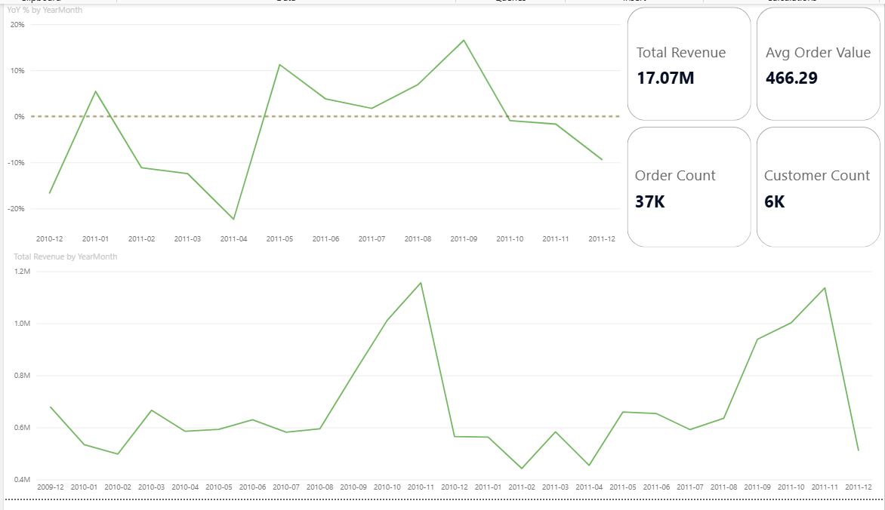
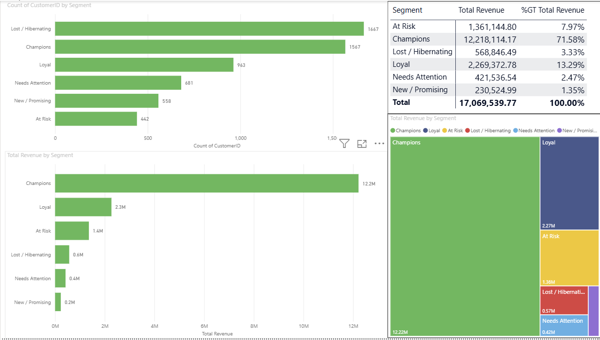

# E-Commerce Customer Segmentation with RFM (Power BI)

Turning one million raw retail transactions into an actionable customer-segmentation
dashboard: extracted and cleaned in Python, scored with an RFM model, and visualised
in a multi-page Power BI report built on a star schema with time-intelligence.


An end-to-end analytics project that turns raw online retail transactions into an
actionable customer-segmentation dashboard. Data is pulled from a real dataset,
cleaned and reshaped in Python, scored with an RFM model, and visualised in a
multi-page Power BI report with a proper star schema and time-intelligence.

## Dashboard Preview





The dashboard has five pages: Executive Summary, RFM Segmentation, Products,
Insights and Recommendations, and Notes. See the Dashboard section below for what
each page contains.

## Business Question

Which customer segments are the most valuable, and where should the marketing
budget be focused?

The project answers this by building RFM (Recency, Frequency, Monetary) segments,
quantifying how much revenue each segment drives, and translating the result into
concrete budget recommendations.

## Tools and Techniques

Python (pandas) for extraction, cleaning, data profiling, and RFM scoring.
Power BI for data modelling and visualisation, specifically:
Power Query (M) for typing and loading, a star-schema data model, DAX measures,
and time-intelligence (year-over-year growth). The analysis emphasises a
transparent, documented cleaning process rather than only the final charts.

## Data Source

Online Retail II, a real UK online retailer's transactions from December 2009 to
December 2011. It is free from the UCI Machine Learning Repository and Kaggle
(search "Online Retail II").

An earlier iteration used a fake-data API (dummyJSON) but was abandoned: it gave
every customer exactly one order, which makes RFM's Frequency dimension
meaningless. Online Retail II has genuine repeat buyers, real dates, and real
customer IDs, so all three of Recency, Frequency, and Monetary become meaningful.
Orders per customer in the cleaned data range from 1 to 373, with a median of 3.

## Repository Structure

```
01_load_online_retail.py   Load the raw file, clean it, export five CSVs
02_rfm_scoring.py          Compute R, F, M per customer and assign segments
inspect_missing.py         Profile the missing-CustomerID rows (no changes made)
audit_data.py              Count duplicates and non-product rows (no changes made)
data/                      Generated CSVs (created by the scripts)
report/                    Power BI report file
README.md
```

The two helper scripts (inspect_missing.py, audit_data.py) only measure the data;
they remove nothing. They exist so that every cleaning decision is made after
looking at the evidence, not blindly.

## Methodology

### 1. Extract and clean (01_load_online_retail.py)

The raw file has 1,067,371 rows. Cleaning is a sequence of evidence-based
decisions, each documented below with the number of rows removed:

Rows with no CustomerID: removed 243,007 (22.8% of rows). RFM is computed per
customer, so a row with no customer identity cannot be attributed and cannot be
imputed. These anonymous rows account for about 13.7% of revenue and are spread
evenly across the whole period, so removing them does not distort any single
time window.

Cancelled invoices (invoice number starting with "C"): removed 18,744. These are
returns and cancellations, not sales.

Non-positive quantity: removed 0 in this dataset (they coincided with cancellations).

Non-positive price: removed 71 (free items and adjustments).

Exact duplicate rows: removed 26,124. Duplicates would inflate both Frequency and
Monetary and directly distort RFM.

Non-product rows: removed 2,833. Stock codes such as POST, DOT, M, BANK CHARGES,
and AMAZONFEE are postage, fees, and manual adjustments, not real products. They
are matched by a known list plus a rule that any all-letter code (no digit) is not
a product code.

After cleaning, 776,592 rows remain. The script then reshapes the data into a
star schema and writes five CSVs:

```
fact_order         36,607 orders (one row per invoice)
fact_order_line   776,592 lines (one row per product within an invoice)
dim_customer        5,852 customers (with country)
dim_product         4,623 products (with description and price)
dim_customer_rfm    one row per customer with R, F, M scores and a segment label
```

### 2. RFM scoring (02_rfm_scoring.py)

For each customer the script computes three raw values: Recency (days since the
last order, measured against the day after the most recent order in the data),
Frequency (number of distinct orders), and Monetary (total spend). Each value is
turned into a 1 to 5 score using quintiles. Recency is scored in reverse, so the
most recent customer scores 5. Frequency and Monetary are scored so that the
highest value scores 5. To avoid the common failure where many tied values break
quantile binning, values are ranked before binning.

Frequency and Monetary scores are averaged into a single value score, and the
segment is read from a simple recency-by-value grid: Champions, Loyal,
New / Promising, At Risk, Lost / Hibernating, and Needs Attention.

### 3. Data model (Power BI)

A star schema with two fact tables (fact_order, fact_order_line) surrounded by
dimensions (dim_customer, dim_customer_rfm, dim_product) and a dedicated Calendar
table. The Calendar table is marked as a date table so that time-intelligence
measures work correctly. Order dates were reduced to date-only so that the fact
table joins cleanly to the calendar.

Key DAX measures: Total Revenue, Revenue LY (same period last year), YoY %,
Order Count, Customer Count, and Avg Order Value.

## Dashboard

The report has the following pages:

Executive Summary: KPI cards (total revenue, order count, customer count, average
order value), a monthly revenue trend, and a year-over-year growth trend.

RFM Segmentation: customers per segment, revenue per segment, and a summary matrix
with each segment's customer count, revenue, and share of total revenue.

Products: top products by revenue and top products by quantity sold. These tell
different stories, since expensive low-volume items and cheap high-volume items
rank differently.

Insights and Recommendations: written findings and concrete actions.

Notes: the data-preparation log and analytical caveats.

## Key Findings

Value is highly concentrated. The Champions segment alone generates 71.6% of total
revenue (12.2M of 17.1M), a clear Pareto pattern.

The At Risk segment is small by count but carries about 1.4M in revenue. Losing
these customers is a direct revenue loss, which makes them a priority for
retention spend.

Lost / Hibernating is the largest segment by customer count but contributes very
little revenue, indicating a large pool of inactive customers.

Revenue is strongly seasonal, peaking every year in November and December.

## Recommendations

Prioritise the marketing budget on retaining Champions (loyalty program, VIP
perks) and on winning back At Risk customers (personalised offers, reactivation
campaigns).

Do not over-invest in Lost / Hibernating; low-cost automated email is sufficient.

Prepare for the year-end sales peak by starting stock and campaign planning by
October.

## Data Preparation and Limitations

This section is deliberately explicit, because honest reporting of what was
removed and why is part of the analysis.

The analysis covers only identified customers. Anonymous transactions, about 13.7%
of revenue, are out of scope because RFM requires a customer identity.

The final month, December 2011, is partial. Its lower value is an artefact of the
data window, not a real decline.

Year-over-year comparison is only meaningful from December 2010 onward, because
2009 contains only December and has no comparable prior period.

The dominance of the Champions segment is partly a consequence of loose segment
thresholds, since high-Monetary customers tend to fall into Champions by
definition. For operational use the thresholds should be tightened to produce a
more discriminating segmentation.

## How to Reproduce

1. Install dependencies:

```
pip install pandas openpyxl
```

2. Download Online Retail II (UCI or Kaggle) and place the file next to the
scripts. The loader accepts the .xlsx or a .csv version. A .csv is recommended,
as it loads much faster and is less prone to download corruption.

3. Run the pipeline in order:

```
python 01_load_online_retail.py
python 02_rfm_scoring.py
```

This produces the five CSVs in the data folder.

4. Open the Power BI report and refresh so it reads the generated CSVs.

## Possible Improvements

Tighten the RFM thresholds so that Champions is a smaller, more exclusive group.
Add a geographic view using the country field in dim_customer. Add interactivity
with slicers by year or country. Add a classic RFM scatter plot of Recency
against Monetary, sized by Frequency and coloured by segment. Move the RFM scoring
into SQL as an alternative implementation to demonstrate window functions.
